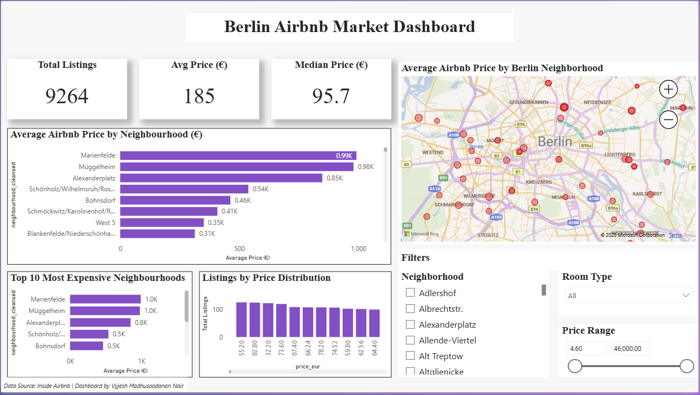

# Berlin Airbnb Market Dashboard (Power BI)

## 📊 Project Overview
This dashboard analyzes Airbnb listings in Berlin to uncover trends in pricing, neighborhood demand, and listing distribution.

## 🔍 Key Insights
- Average and median price across Berlin listings
- Most expensive neighborhoods
- Price distribution trends
- Map visualization of listing concentration
- Room type and price filtering

## 🛠 Tools Used
- Power BI
- Power Query
- DAX
- Berlin Airbnb Open Data

## 📁 Files Included
- Power BI dashboard (.pbix)
- Dashboard preview image

## 🖼 Dashboard Preview

## 📌 Author
**Vyjesh Madhusoodanan Nair**  
Master’s in Data Science — Berlin  
Aspiring Data Analyst / BI Analyst
